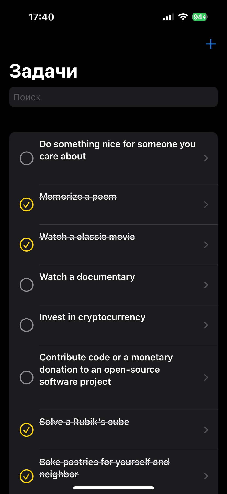
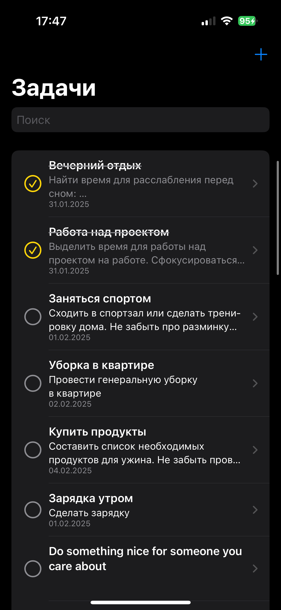
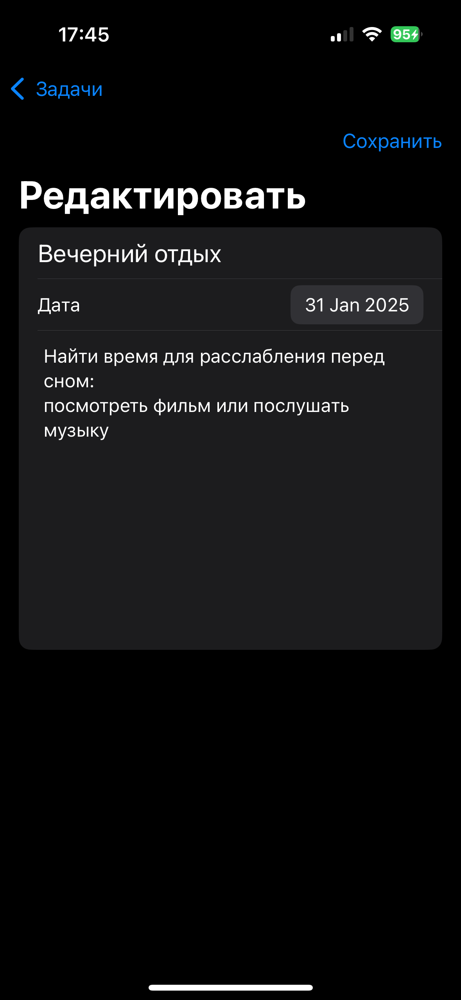

# ToDoList

ToDoList — это простое и удобное приложение для управления задачами, разработанное на SwiftUI. Оно позволяет быстро добавлять, редактировать и организовывать задачи, помогая пользователям эффективно управлять своим временем.

## 📌 Функциональность
- Добавление, редактирование и удаление задач
- Изменение отображения задач в зависимости от их статуса:
- Выполненные задачи отображаются с зачеркнутым названием и серым описанием
- Поиск задач с сортировкой в процессе набора
- Управление состоянием с использованием `@StateObject`

## 🛠️ Используемые технологии
- SwiftUI
- CoreData
- MVVM архитектура
- @StateObject для управления состоянием

## 🚀 Установка и запуск
1. Клонируйте репозиторий:
   ```sh
   git clone https://github.com/domrachefff/ToDoList.git
   ```
2. Откройте проект в Xcode
3. Соберите и запустите приложение на симуляторе или реальном устройстве

## 📷 Скриншоты
### Главный экран  





### Редактирование/Добавление задачи  



## 📌 Будущие обновления
- Добавление уведомлений о предстоящих задачах
- Поддержка синхронизации через iCloud
- Улучшение UI/UX

## Контакты

- **Автор**: Домрачев Алексей
- **Email**: domrachefff.a@yandex.ru

